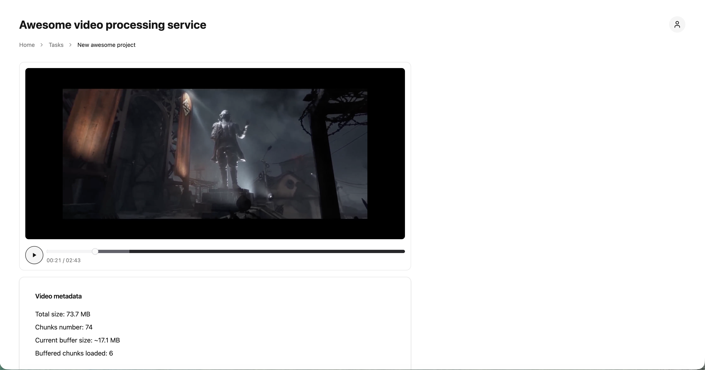
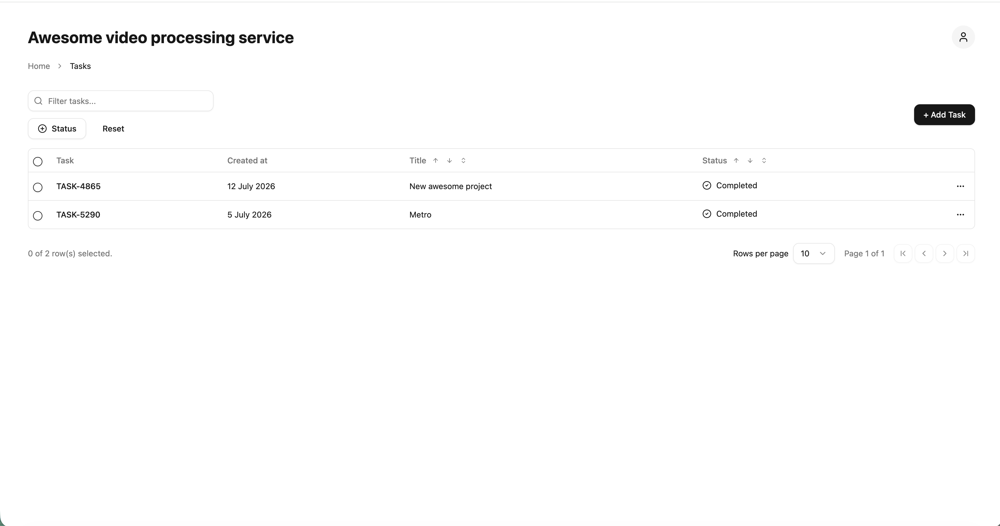

# 🚀🎬 Video Streaming (Local DASH Pipeline)

A local video processing and playback app built with Next.js.  
It accepts uploaded videos, transcodes them into DASH format with FFmpeg in a background worker, and plays ready streams in the browser via Vidstack + dash.js.




## Purpose

This project provides an end-to-end local streaming workflow:

- upload a source video from the UI
- process it asynchronously into DASH segments + manifest
- track processing status (`pending`, `processing`, `ready`, `failed`)
- play the final stream from local filesystem-backed endpoints

It is designed for local development and feature iteration (no cloud storage or database yet).

## Tech Stack

- **Framework:** Next.js 14 (App Router)
- **Language:** TypeScript + React 18
- **Data Fetching:** TanStack Query
- **Playback:** Vidstack (`@vidstack/react`) + dash.js
- **UI:** Radix UI primitives + shadcn-style component patterns
- **Lint/Format:** Biome
- **Processing:** FFmpeg (DASH generation)
- **Background Scheduling:** `cron` npm package (worker loop)
- **Storage:** Local filesystem under `videos/`

## Work Schema (Processing Flow)

1. User uploads a video through `/api/videos/upload`.
2. A video record is created with `pending` status.
3. Background worker scans for jobs every ~15 seconds.
4. FFmpeg converts input into DASH output (`manifest.mpd` + segments).
5. Status is updated to:
   - `ready` on success
   - `failed` on processing error
6. Client polls list/status APIs and plays ready media through Vidstack on the task detail page.

## Status Lifecycle

`pending -> processing -> ready | failed`

## App Routes

- `/` — tasks list
- `/tasks/new` — upload form
- `/tasks/[id]` — task detail + DASH player

## Playback Endpoints

Ready videos are served from:

- Manifest: `/api/dash/<videoId>/manifest.mpd`
- Segments: `/api/dash/<videoId>/segment/<asset-path>`

The manifest API rewrites on-disk FFmpeg output at serve time to inject segment `BaseURL`s pointing at the segment route above.

## Local Storage Schema

All runtime assets are stored on disk:

- `videos/uploads/<videoId>/<original-file>`
- `videos/dash/<videoId>/manifest.mpd` (+ segment files)
- `videos/records/<videoId>.json`
- `videos/locks/<videoId>.lock`

## Prerequisites

- Node.js v24 (see `.nvmrc`)
- npm
- FFmpeg available in your system `PATH`

Check FFmpeg:

```bash
ffmpeg -version
```

## Required Commands

Use the project Node version:

```bash
nvm use
```

Install dependencies:

```bash
npm install
```

Run development server:

```bash
npm run dev
```

Create production build:

```bash
npm run build
```

Start production server (after build):

```bash
npm run start
```

Format, typecheck, and lint:

```bash
npm run lint:fix
npm run typecheck && npm run lint
```

If Next.js build cache gets corrupted with route resolution issues:

```bash
rm -rf .next && npm run build
```

## Notes

- Worker initialization is triggered by server init imports in API routes.
- The app currently has no authentication/authorization layer.
- This is a filesystem-first implementation (no DB/S3 integration yet).
