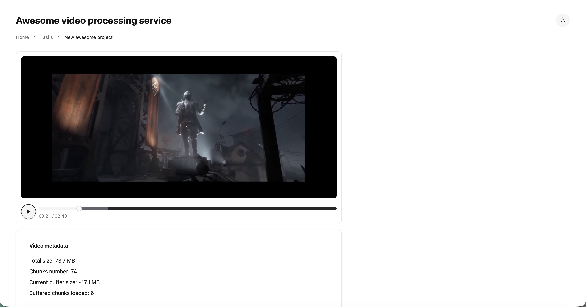
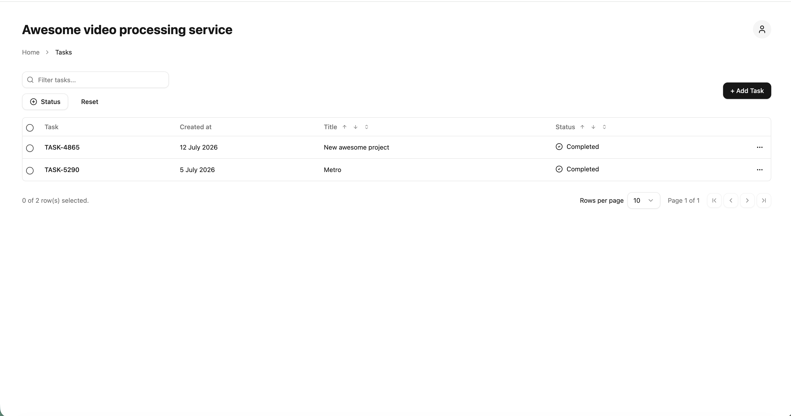

# Language Learning with Video

Help learners study a foreign language from real video. Upload a clip in the language you are learning; the app returns a **longer, learner-friendly video** with burned-in subtitles, highlighted tricky phrases (idioms, collocations, hard grammar), and **short explanation inserts** that play right after the sentence containing each phrase.

A **Next.js** UI and **Nest.js** worker run locally. Playback is DASH (Vidstack + dash.js) of the *enriched* video, not the raw upload.




## Purpose

On upload, the user chooses:

- **Video language** — spoken language of the source (`sourceLanguage`)
- **Explanation language** — language for AI explanations and TTS narration (`explanationLanguage`)
- **Language level** — CEFR `A1`–`C2` (`languageLevel`); filters which phrases are worth explaining

The pipeline then:

1. transcribes speech with word/segment timestamps (Whisper)
2. flags learner-relevant phrases and writes short explanations (OpenAI)
3. turns each explanation into TTS audio plus a text slide
4. composes a destination video: original footage + subtitle burn-in + phrase highlights + explanation clips spliced after the target sentence
5. packages that enriched file as DASH for in-app playback

Status is `pending` → `processing` → `ready` | `failed`. Local filesystem only (no cloud storage or database yet).

## Tech Stack

- **Frontend:** Next.js 14 (App Router) in `frontend/`
- **Backend:** Nest.js in `backend/`
- **Language:** TypeScript + React 18
- **Data Fetching:** TanStack Query
- **Playback:** Vidstack (`@vidstack/react`) + dash.js
- **UI:** Radix UI primitives + shadcn-style component patterns
- **Lint/Format:** Biome (frontend)
- **Transcription:** OpenAI Whisper (`whisper-1`, word timestamps)
- **Phrase analysis:** OpenAI (`gpt-5.6-luna`)
- **TTS:** OpenAI (`gpt-4o-mini-tts`) for explanation narration
- **Processing:** FFmpeg (explanation slides, video compose, DASH packaging)
- **Logging (backend):** Pino via `nestjs-pino` (pretty-print in development)
- **Background Scheduling:** `cron` npm package (Nest worker loop)
- **Storage:** Local filesystem under repo-root `videos/`
- **Local dev:** Docker Compose (`compose.yaml`)

## Work Schema (Processing Flow)

1. User uploads a video with language settings via Nest `POST /api/videos/upload` (`pending`).
2. Background worker (started when Nest boots) picks up jobs about every 15 seconds.
3. Audio is extracted; Whisper writes a timed transcript.
4. The LLM detects tricky phrases and explanations for the chosen CEFR level.
5. Each explanation becomes TTS audio and an FFmpeg text-slide clip.
6. FFmpeg composes the enriched video (subtitles, highlights, inserts after target sentences).
7. The enriched file is packaged as DASH (`manifest.mpd` + segments).
8. Status becomes `ready` or `failed`. The client polls Nest and plays ready media on the task detail page.

## Status Lifecycle

`pending -> processing -> ready | failed`

## App Routes (frontend)

- `/` — tasks list
- `/tasks/new` — upload form
- `/tasks/[id]` — task detail + DASH player

## Playback Endpoints (backend)

Ready videos are the **enriched** learner cut, served from Nest (`http://localhost:3001` by default):

- Manifest: `/api/dash/<videoId>/manifest.mpd`
- Segments: `/api/dash/<videoId>/segment/<asset-path>`

The manifest API rewrites on-disk FFmpeg output at serve time to inject segment `BaseURL`s pointing at the segment route above. The browser loads the manifest from Nest, so relative segment URLs resolve to Nest.

## Local Storage Schema

All runtime assets are stored on disk at the repo root:

- `videos/uploads/<videoId>/` — source upload
- `videos/audio/<videoId>/track.mp3` — extracted audio for transcription
- `videos/transcripts/<videoId>/transcript.json` — timed transcript
- `videos/explanations/<videoId>/phrases.json` — detected phrases + explanations
- `videos/explanations/<videoId>/clips/` — TTS audio, slides, and insert clips
- `videos/enriched/<videoId>/output.mp4` — composed learner video (pre-DASH)
- `videos/dash/<videoId>/` — DASH of the *enriched* video (`manifest.mpd` + segments)
- `videos/records/<videoId>.json` — metadata including language settings
- `videos/history/<videoId>.json` — processing step history
- `videos/locks/<videoId>.lock`

## Prerequisites

- Docker with Compose v2 (Docker Desktop or equivalent)
- Copy `backend/.env.example` to `backend/.env` and set `OPENAI_API_KEY` (needed for Whisper transcription and phrase detection)

FFmpeg is installed in the backend image (used for compose and DASH); you do not need it on the host when using Compose. `OPENAI_API_KEY` is required for transcription, phrase detection, and explanation TTS.

## Local development (Docker Compose)

From the repository root:

```bash
cp backend/.env.example backend/.env   # then set OPENAI_API_KEY
docker compose up --build
```

Or `npm run dev` from the repo root (same as `docker compose up`).

- Frontend: [http://localhost:3000](http://localhost:3000)
- Backend: [http://localhost:3001](http://localhost:3001) (global prefix `/api`)

Source is bind-mounted, so frontend and backend hot-reload on file changes.

After `package.json` or lockfile changes, rebuild (`docker compose up --build`). To reset container `node_modules` / build caches, run `docker compose down -v` (the bind-mounted `videos/` directory is not removed).

Compose sets `NEXT_PUBLIC_API_URL=http://localhost:3001` and `CORS_ORIGIN=http://localhost:3000` so the browser can call Nest on the host-published ports.

## Without Docker

Use the project Node version, and install FFmpeg on your `PATH`:

```bash
nvm use
ffmpeg -version
```

Terminal 1 (backend):

```bash
cd backend
npm install
cp .env.example .env   # then set OPENAI_API_KEY
npm run start:dev
```

Terminal 2 (frontend):

```bash
cd frontend
npm install
npm run dev
```

Optional frontend env (`frontend/.env.local`):

```bash
NEXT_PUBLIC_API_URL=http://localhost:3001
```

Optional backend env:

```bash
PORT=3001
CORS_ORIGIN=http://localhost:3000
LOG_LEVEL=debug
VIDEO_PROCESSOR_CRON="*/15 * * * * *"
STORAGE_ROOT=/absolute/path/to/videos
```

## Other commands

Create production builds:

```bash
cd backend && npm run build && npm run start:prod
cd frontend && npm run build && npm run start
```

Format, typecheck, and lint (host Node; run `nvm use` first):

```bash
cd frontend && npm run lint:fix && npm run typecheck && npm run lint
cd backend && npm run typecheck
```

If Next.js build cache gets corrupted with route resolution issues:

```bash
cd frontend && rm -rf .next && npm run build
```

## Notes

- Worker initialization runs on Nest module init (not via Next API routes).
- The app currently has no authentication/authorization layer.
- This is a filesystem-first implementation (no DB/S3 integration yet).
